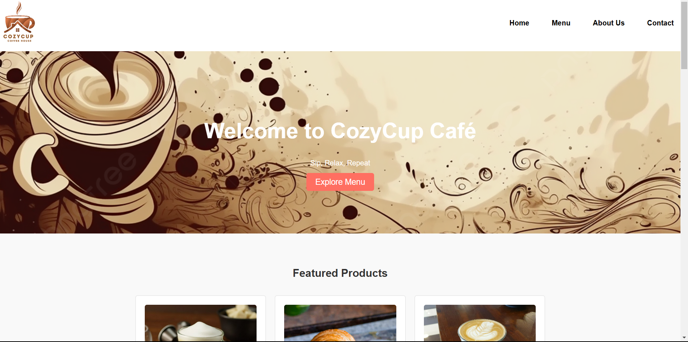
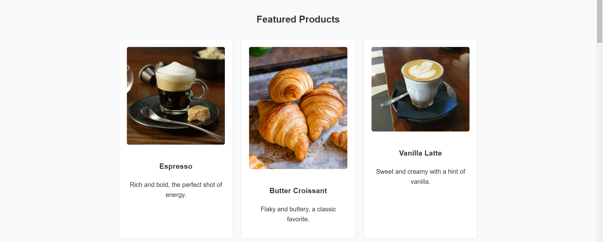
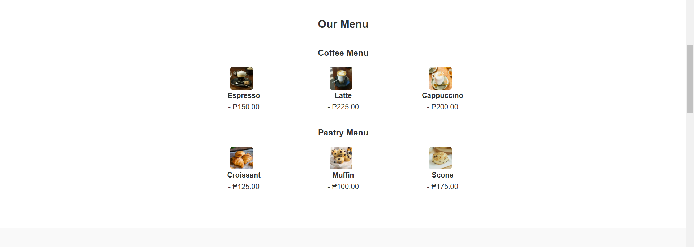
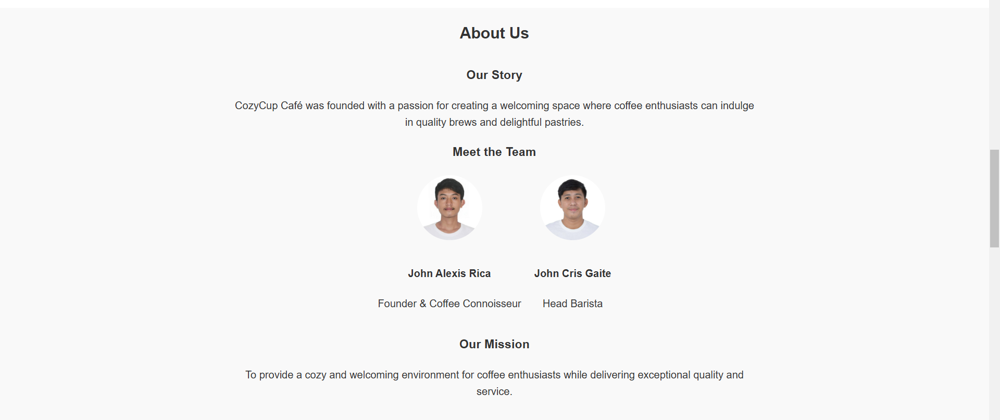
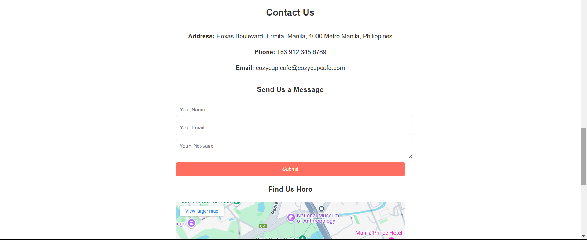
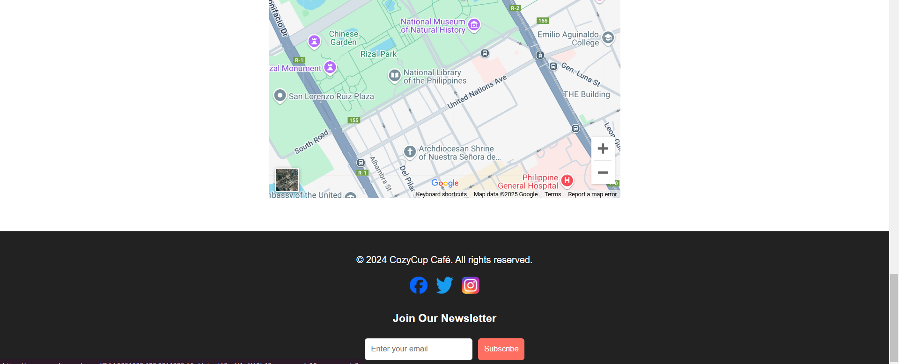

# CozyCup_Rica-Gaite

# CozyCup Café

The **CozyCup Café** website is a sleek and inviting online presence designed to showcase the café's offerings and atmosphere. It features a clean and modern layout with easy navigation to key sections: **Home**, **Menu**, **About Us**, and **Contact**. The website emphasizes user experience with visually appealing background images for each section, including the hero area, menu display, and background information about the café.

## Features

- **Home**: Warmly welcomes visitors with a call-to-action button guiding them to explore the menu.
- **Menu**: Highlights the variety of beverages and pastries offered at CozyCup Café.
- **About Us**: Shares the story behind CozyCup Café and its commitment to quality coffee.
- **Contact**: Provides easy access for visitors to reach out for inquiries or feedback.

## Design

- Responsive layout for a smooth browsing experience on any device.
- Aesthetic background images for each section to enhance the atmosphere.
- Modern color scheme with clean typography for easy readability.

The website serves as the perfect introduction to the cozy and charming environment of **CozyCup Café**, inviting both new and returning customers to explore, learn, and connect.

## Screen Captures

Home Page

Featured Products

Menu

About the Team

Last Page of the Website
## Authors
### Name: *John Alexis Rica*  
### Email: *202080107@psu.palawan.edu.ph*  
### Name: *John Cris Gaite*
### Email: *201720022@psu.palawan.edu.ph*

## Technologies Used

- HTML
- CSS
- Responsive Design

---

Feel free to explore and contribute to the project!

